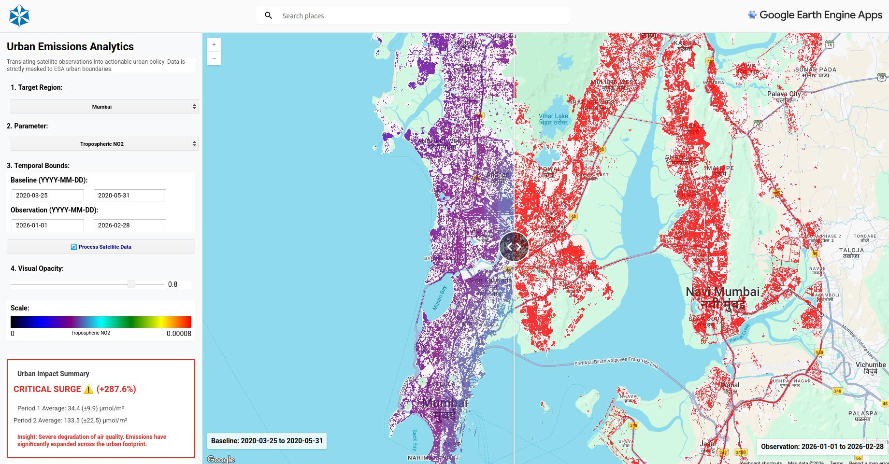

# India Air Quality & Urban Emissions Analytics 🌍


---

## Overview

This repository hosts an **interactive GeoAI dashboard** built with the Google Earth Engine (GEE) JavaScript API for analyzing urban air quality in India.

The project originated from localized concerns over dust, smoke, and respiratory health in Pune, India, but scales to **national-level insights**, allowing users to quantify the impact of urban sprawl and traffic across India’s major metropolitan areas.  

It compares current atmospheric conditions to the **2020 COVID-19 lockdown baseline (“The Anthropause”)**, which represents an unprecedented clean-air scenario.

👉 **[View the Live Interactive App Here](Ihttps://gee-xplore-491304.projects.earthengine.app/view/india-emissions-analytics)**

  

---

## 🎯 Showcase Angles

* **Scientific Rigor:** Implements strict QA masking, urban isolation, and transparent variance reporting (μ ± σ).  
* **Data Engineering Expertise:** Handles GEE ingestion quirks, missing bands, and server-side errors with robust logic.  
* **Interactive Visualization:** Split-map dashboards, histograms, and absolute difference layers make pollution trends tangible.  
* **Scalable Architecture:** Easily add new cities or pollutants by modifying a single dictionary.

---

## The Scientific Methodology

To transform satellite data into a **defensible analytical instrument**, the pipeline uses:

1. **Calibrated Datasets:** Copernicus Sentinel-5P **OFFL (Offline)** datasets for scientific-grade accuracy.  
2. **Strict QA Masking:** Applies ESA-mandated thresholds (e.g., `<30%` cloud fraction for NO₂) to avoid meteorological bias.  
3. **Urban Extent Isolation:** Uses **ESA WorldCover 10m** to mask calculations strictly to built-up areas (Class 50), preventing rural “dilution” of urban emission averages.  
4. **Statistical Transparency:** Computes mean ± standard deviation (μ ± σ) and pixel counts (N) to quantify significance and reliability.  

---

## Key Features

* **Multi-Pollutant Tracking:** Tropospheric Nitrogen Dioxide (NO₂) and Aerosol Index (UVAI).  
* **Absolute Anomaly Maps:** Highlights neighborhoods with the most significant atmospheric degradation.  
* **Policy-Ready Analytics:** Converts raw column densities into readable units and calculates percentage changes.  
* **Spatial Histograms:** Visualizes the geographic distribution of pollution hotspots for targeted urban planning.

---

## ⚡ Engineering Lessons Learned

* **Band Awareness:** Sentinel-5P OFFL ingestion in GEE may drop QA bands. NO₂ masking uses `cloud_fraction < 0.3`; Aerosol Index bypasses QA masking.  
* **Robust `.evaluate()` Handling:** Prevents server errors and null results from crashing the UI. Warnings display gracefully for users.  
* **Urban-Weighted Statistics:** μ ± σ is calculated only on valid urban pixels, ensuring the analysis reflects reality, not background noise.

---

## 🚀 How to Run

1. Fork or clone this repository.  
2. Open `app.js` in the [Google Earth Engine Code Editor](https://code.earthengine.google.com/).  
3. Replace `Insert_Your_GEE_App_Link_Here` with your deployed app link.  
4. Click **Run**, then use the dropdowns and date selectors to explore urban pollution trends across Indian cities.

---

## 🛠️ How to Add Your Own City

The architecture is modular. To include a new city:

1. Open `app.js` in the GEE Code Editor.  
2. Locate the `cities` dictionary at the top of the script.  
3. Use a tool like [bboxfinder.com](http://bboxfinder.com/) to draw a bounding box around your target city `[MinLon, MinLat, MaxLon, MaxLat]`.  
4. Add the city to the dictionary:

```javascript
var cities = {
  'Pune & PCMC': ee.Geometry.Rectangle([73.60, 18.40, 74.00, 18.75]),
  // Example:
  'Hyderabad': ee.Geometry.Rectangle([78.30, 17.30, 78.60, 17.50])
};
````
---

## License

This project is licensed under the [MIT License](LICENSE).

